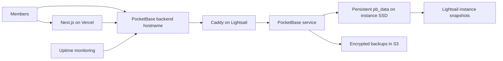

# Proposed AWS Hosting Plan

**Status:** Future option; not approved or scheduled

**Recorded:** August 12, 2026

**Scope:** Move the production PocketBase backend from the owner's home Ubuntu server to AWS. Keep the Next.js application on Vercel.

## Purpose

The current backend depends on the owner's home power, network equipment, ISP connection, and physical cabling. A hardware or connectivity failure can therefore make the site unavailable even when the application itself is healthy.

This proposal moves that single point of failure to AWS while keeping the architecture small and inexpensive. It also creates an opportunity to gain practical AWS experience in compute, DNS, IAM, object storage, monitoring, backups, and infrastructure as code.

This document is a reference plan only. It does not authorize infrastructure changes or a production migration.

## Recommended Starting Architecture

Use a **1 GB Amazon Lightsail Linux instance with public IPv4**, expected to cost **$7 per month** at the time this plan was recorded. Run PocketBase on the instance under `systemd`, with Caddy providing HTTPS and reverse proxying.

The browser must continue to reach PocketBase directly for realtime subscriptions and stored files. Vercel server actions and routes will also continue to call PocketBase.

### AWS components

- **Lightsail:** One Ubuntu instance, initially with 1 GB RAM, a static public IP, and the region closest to the majority of members. Ohio is the default candidate.
- **S3:** A dedicated private bucket for PocketBase backups, with encryption, blocked public access, versioning where useful, and a lifecycle policy that removes expired backups.
- **IAM:** Dedicated least-privilege credentials limited to the backup bucket. Do not reuse root or administrator credentials.
- **DNS:** Prefer retaining the existing backend hostname and changing only its DNS target. Existing Cloudflare DNS can remain in place; Route 53 is optional.
- **TLS:** Caddy obtains and renews the public certificate automatically.
- **Monitoring:** External uptime checks plus AWS resource monitoring and billing alerts.
- **Budgets:** Notifications near $10 and $15 of forecast or actual monthly AWS spend.

## Expected Cost

These figures are planning estimates, not a quote. Verify current AWS pricing immediately before provisioning.

| Item | Planning estimate |
| --- | ---: |
| 1 GB Lightsail Linux instance with public IPv4 | $7/month |
| Lightsail snapshots | Usually less than $1/month at this scale |
| S3 backup storage and requests | Usually pennies per month at this scale |
| Route 53 hosted zone, if adopted | Approximately $0.50/month, excluding domain registration |
| **Expected total** | **Approximately $8-10/month** |

References:

- [Amazon Lightsail pricing](https://aws.amazon.com/lightsail/pricing/)
- [Lightsail snapshots](https://docs.aws.amazon.com/lightsail/latest/userguide/understanding-instance-snapshots-in-amazon-lightsail.html)
- [Amazon S3 pricing](https://aws.amazon.com/s3/pricing/)
- [Route 53 pricing](https://aws.amazon.com/route53/pricing/)

Use a public-IPv4 bundle for the first migration. An IPv6-only bundle is cheaper, but the additional connectivity and DNS considerations are not worth introducing during the initial move.

## PocketBase Storage and Backup Rules

PocketBase uses SQLite and local files. Its live `pb_data` directory must remain on persistent local block storage; it must not be placed directly on S3 or another object-store-mounted filesystem.

Use two independent recovery mechanisms:

1. **PocketBase application backups to S3:** Create a nightly full backup of `pb_data`. Retain an appropriate daily and weekly history using an S3 lifecycle policy.
2. **Lightsail instance snapshots:** Enable automatic snapshots for recovery from a damaged instance or operating-system change.

The S3 copy is the more important disaster-recovery layer because it is separate from the instance. Instance snapshots alone are not a complete backup strategy.

Before production cutover, restore a PocketBase backup into a disposable instance and confirm that authentication, records, uploaded album artwork, avatars, feedback attachments, and realtime behavior all work. Repeat a restore test periodically after migration.

Suggested recovery objectives for this small application:

- **Recovery point objective:** At most 24 hours of data loss, based on nightly backups. Reduce this interval later if activity warrants it.
- **Recovery time objective:** Restore service within four hours using a documented backup and replacement instance.

PocketBase production and backup references:

- [PocketBase production deployment](https://pocketbase.io/docs/going-to-production/)
- [PocketBase backup API](https://pocketbase.io/docs/api-backups/)

## Security Baseline

- Enable MFA on the AWS account and do not use the root user for normal administration.
- Grant administrative access through a named IAM identity with only the permissions required for this project.
- Give PocketBase backup credentials access only to the dedicated S3 bucket and required object actions.
- Block all public S3 access and enable encryption at rest.
- Allow public inbound traffic only on ports 80 and 443. Restrict SSH by source address where practical, use SSH keys, and disable password login.
- Bind PocketBase to localhost so that only Caddy exposes it publicly.
- Keep the PocketBase superuser credentials and all application secrets out of source control.
- Apply security updates and PocketBase upgrades deliberately, with a snapshot and tested rollback path.
- Configure AWS billing alerts before creating long-lived resources.

## Migration Plan

### 1. Inventory and rehearse

- Record the exact production PocketBase version and service arguments.
- Measure `pb_data` and its growth rate.
- Inventory the current public backend hostname, DNS, CORS configuration, email settings, and backup process.
- Create and test a fresh PocketBase backup.
- Rehearse the full migration with a copy of production data on a temporary AWS hostname.

### 2. Provision AWS

- Create the AWS budget alerts first.
- Provision the 1 GB Lightsail Ubuntu instance and attach a static IP.
- Configure the Lightsail firewall, SSH hardening, automatic snapshots, system updates, and basic monitoring.
- Create the private S3 backup bucket and least-privilege IAM credentials.

### 3. Install the backend

- Install the same PocketBase version used by production.
- Deploy this repository's `pb_migrations` directory.
- Restore the rehearsed `pb_data` backup.
- Configure PocketBase as a non-root `systemd` service.
- Configure Caddy and a temporary hostname with HTTPS.
- Configure and verify scheduled PocketBase backups to S3.

### 4. Validate before cutover

- Run schema and migration checks.
- Test signup/login, Google login, draw and rating flows, board realtime, catalog artwork, reviews and replies, groups, feed behavior, feedback attachments, and admin access.
- Verify server restarts, automatic service recovery, certificate renewal configuration, monitoring alerts, S3 backups, and restoration.
- Confirm that logs and backup artifacts do not contain exposed secrets.

### 5. Cut over

- Announce a short maintenance window.
- Stop writes to the home PocketBase instance.
- Create one final backup and restore or synchronize it to Lightsail.
- Start and smoke-test the AWS instance.
- Point the existing backend hostname to the Lightsail static IP. Reduce DNS TTL ahead of time if needed.
- If the hostname changes, update `NEXT_PUBLIC_PB_URL` and any related Vercel environment settings, CORS rules, and allowed origins, then redeploy the application.
- Monitor application behavior, resource usage, realtime connections, and error logs closely after the switch.

### 6. Retire the old path safely

- Keep the home instance powered off or read-only but recoverable for at least seven days.
- Preserve the final pre-cutover backup independently.
- Remove the Cloudflare Tunnel and old service only after AWS operation and backup restoration have been verified.
- Update `docs/pocketbase-runbook.md` so AWS becomes the canonical production procedure.

## Rollback Plan

Before cutover, rollback is simply cancellation of the migration. After cutover:

1. Stop writes to the AWS instance.
2. Capture a current AWS PocketBase backup so post-cutover user activity is not lost.
3. Restore that backup to the home instance if its data has changed since cutover.
4. Start and validate the home service.
5. Return DNS to the previous endpoint.

Do not point traffic back to the old server using its stale pre-cutover database after members have written data to AWS.

## Verification Checklist

The migration is complete only when all of the following are true:

- The production hostname serves a valid HTTPS certificate.
- PocketBase is not directly exposed on its internal port.
- All primary authenticated application flows pass.
- Realtime updates work between at least two browser sessions.
- Locally stored files render correctly.
- PocketBase restarts automatically after an instance reboot.
- A nightly S3 backup is created successfully.
- A backup has been restored successfully into a disposable environment.
- Lightsail snapshots, external uptime alerts, and AWS budget alerts are active.
- The production runbook identifies owners, credentials locations, backup procedures, restoration steps, and upgrade procedures.

## AWS Learning Path

Keep the first migration intentionally small, then add operational maturity in stages:

1. **Initial migration:** Lightsail, static IP, Caddy, S3, IAM, snapshots, and budgets.
2. **Repeatability:** Represent infrastructure with Terraform and document deployment and restoration commands.
3. **Operations:** Add CloudWatch metrics or alarms, centralized logs where useful, and a regular restore drill.
4. **Delivery:** Automate tested PocketBase binary and migration deployment without automating production database changes blindly.
5. **Optional EC2 graduation:** Export a Lightsail snapshot to EC2 when deeper VPC, EBS, Systems Manager, CloudWatch, or security-group experience justifies the added complexity.

AWS supports exporting Lightsail instance snapshots to EC2 as AMIs and EBS volumes, so starting with Lightsail does not block that progression. See [Export Lightsail snapshots to EC2](https://docs.aws.amazon.com/lightsail/latest/userguide/amazon-lightsail-exporting-snapshots-to-amazon-ec2.html).

## Decision Triggers

Proceed with this plan when the owner decides that improved availability and AWS experience justify an ongoing budget of roughly $10 per month and the responsibility of maintaining a small Linux server.

Re-evaluate the plan before implementation if any of these have changed:

- PocketBase data exceeds the proposed instance or backup capacity.
- Traffic or availability requirements require multiple active instances; SQLite and local PocketBase files make horizontal high availability a different architecture project.
- The application moves away from PocketBase.
- A managed PocketBase provider offers a preferable support, backup, and service-level arrangement.
- The Next.js hosting strategy changes from Vercel to AWS; that should be evaluated as a separate phase rather than bundled into the PocketBase migration.

## Decision Record

No hosting change has been selected. The working preference, if the home backend is moved in the future, is to start with AWS Lightsail rather than a full EC2 architecture. This keeps the cost predictable and the initial migration understandable while preserving a path to broader AWS services later.
